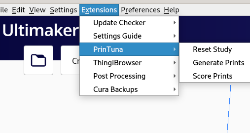
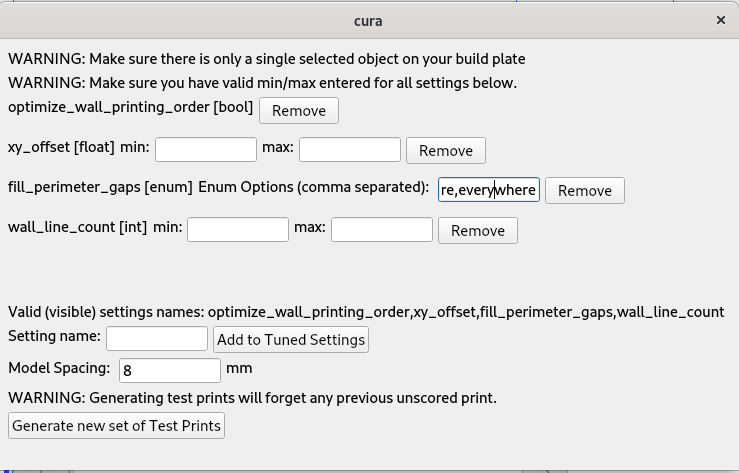

# Printuna Automatic Slicer Tuner

PrinTuna is a plugin for [Cura](https://github.com/Ultimaker/Cura) which helps remove the tedium of tuning your slicer
settings.

Printuna uses a black-box parameter tuner [Optuna](https://optuna.readthedocs.io/en/stable/) to automatically find
good settings for you.

Here's how it works:

1. You load your test model into Cura, and tell PrinTuna which parameters you want to tune.
2. PrunTuna will generate a grid of the test object, each copy with slightly different parameters.
3. You print out the grid of objects, and tell printuna how each object fared, giving it a rating from 1 to 10.
4. Go back to step 2 and repeat!

Printuna is smarter than random search, so if it notices certain settings result in better prints, it will try out those
settings more often!  At any point you can stop the process and use the settings that resulted in the best print you
have seen so far.


## Installation
To install PrinTuna, just copy this folder into your plugins directory for Cura. e.g. ~/.local/share/cura/4.8/plugins/.

Note that PrinTuna contains a vendored copy of Optuna and all it's dependencies, so it's a pretty big download.

## Detailed Instructions

First of all, let me apologize that this plugin is so unpolished, and will crash if you input any wrong data.
I hope to iron out the edges in future releases.

### 1. Import test model
The first step is to import our test model into cura. You can use any test model you like which tests out the settings
you are trying to tune.  In this example I use the 3DBenchy.


It is important to make sure that we have only a **single** object.

### 2. Select Settings to Tune

PrinTuna will not work if the settings you wish to tune are not visible in the per-object settings menu.  The first step
you must take is to make any settings you wish to tune visible.

To do so, select the test object, click the Per Model Settings tool on the lefthand toolbar and click the 
"Select Settings" button:


In the window that opens, check all of the settings you wish to tune.  

Note that this means that any setting which cannot be controlled per-model (such as temperature and retraction) 
**cannot be tuned by PrinTuna**.  If this makes you sad, complain on [this Cura issue](https://github.com/Ultimaker/Cura/issues/3193).

### 2. Generate Prints
Before we continue, it is important to make sure that the test object is selected **selected**.

In the Extensions menu, you will see three options under PrinTuna (if not, this means you haven't properly installed the plugin)



Select the "Generate Prints" menu.  This will pop open the following dialog box:



Now, we need to configure which settings we want printuna to tune.  We can see in the above screenshot that currently
we have configured to tune just the **line_width** setting, between the bounds of 0.1 and 0.4.

Note that the name "line_width" is **not** the same as the name of the setting as it shows up in the Cura UI. It is important that you
put in "line_width" here and NOT "Line Width", or you will get a crash.  The situation is the same for all other settings as well.

Unfortunately, I don't know an easy way to figure out the correspondence between these two forms of the name.  
https://github.com/Ultimaker/Cura/blob/78ecb7ec9a0c1deae6c322a286a13ee70a07e379/plugins/LegacyProfileReader/DictionaryOfDoom.json
may help you to find the name of a setting you are looking for.

PrinTuna only supports tuning floating point settings yet. Please complain in a bug report if this upsets you.

Once you have chosen the settings/ranges you want to tune, click the "Generate new set of Test Prints" button. You
should now see your model tiled on the build surface, with each copy having different settings:


### 3. Print your parts
Now, slice your models, and print them on your 3D printer.  Remember to keep track of exactly the location of each model
because there will be nothing to distinguish them from each other besides how good they look!

### 4. Report the Quality of the Test Prints
Now, in Cura, select the "Score Prints" menu option.  You will see the following window:


Here is where we will enter our subjective scores for how good each print turned out.  You can use arbitrary floating
point numbers as scores, but I prefer to use a scale of 1 to 10.  It's up to you what you want to grade the prints on.
Whatever criteria you choose, PrinTuna will optimize for that!

Now, it is important to remember the ordering of the prints on the board, because we need to make sure to enter their
scores in order.  The first text box corresponds to the print in the back left corner of your build surface, and the
second text box to the print in front of it.  e.g. if you had a 3x3 grid of prints, you would enter them in the order:

```
1 4 7
2 5 8
3 6 9
```

Once you have entered all scores (you must enter all scores!), you can click the "Submit Scores" button.  PrinTuna will
then register the scores you have given it.

### 4. Repeat?
At this point I suggest writing down the settings of any prints you particularly liked, since PrinTuna won't remember
them for you (yet).

Now, it's time to ask PrinTuna to generate a new set of test prints based on what it learned!  However, we must first
make sure that we only have a single object loaded in Cura, rather than the old grid of objects.  Typically you can just
undo and you will get back your original test print object.  Once you have done that, you can jump back to step 2!

You can stop at any point when you are satisfied with one of the configurations PrinTuna found.


## License

PrinTuna is Copyright 2022 Jeremy Salwen and contributors, licensed under the AGPL 3.0.

It is based on code from the [Cura Meshtools](https://github.com/fieldOfView/Cura-MeshTools) plugin.